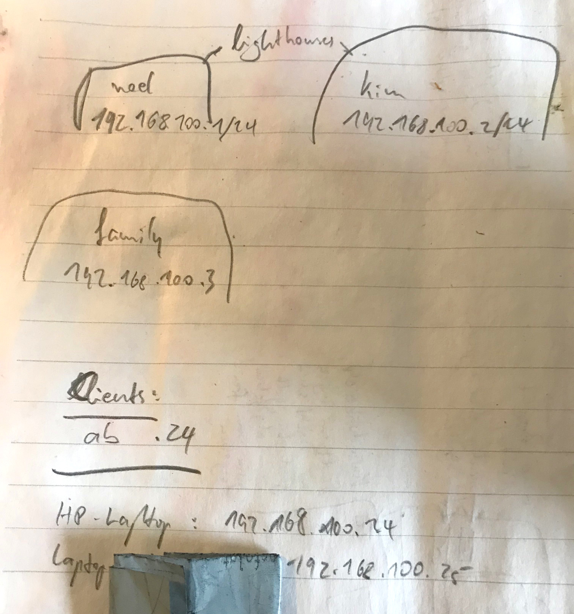
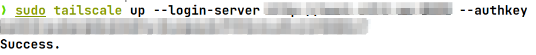
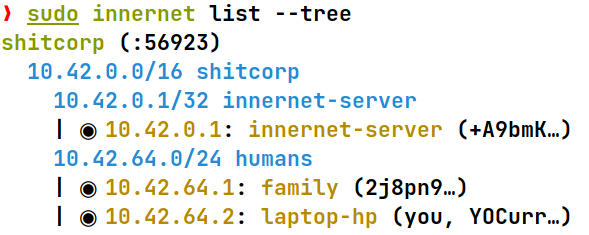

# Overlay Networking

A small writeup about overlay networking and the experiences I've made in the past days. Maybe its helpful for someone else struggling with the same topic.

## The Problem

I wanted an overlay network spanning across multiple servers in different datacenters from different hosting providers. My requirements were that there is **no hub-and-spoke** like architecture and instead every peer should have a **point-to-point** connection to every other peer in the network. The solution should also be **lightweight** on the peers. Oh and **encryption** would be sweet lol. 

Naturally a Wireguard[^wg] mesh network came to mind as it meets all the requirements.

## The Options

- [Tailscale](https://tailscale.com) • [link](https://github.com/tailscale) • [notes](./notes/tailscale.md)
- Headscale • [link](https://github.com/juanfont/headscale) • [notes](./notes/headscale.md)
- [Nebula](https://www.defined.net/nebula/) • [link](https://github.com/slackhq/nebula) • [notes](./notes/nebula.md)
- Netmaker • [link](https://github.com/gravitl/netmaker) • [notes](./notes/netmaker.md)
- Innernet • [link](https://github.com/tonarino/innernet) • [notes](./notes/innernet.md)

> If there is some sort of company behind the product, you can go to the official website by clicking the name

## The Journey
<!--

- Tailscale, mega ding, feier ich übertrieben, aber ... -> nebula, war gut, nur keys immer manuell machen zu müssen ist kopffick und ios app hat nicht funcktioniert oder ich war zu dumm, overall aber eig gut (wenn key management funktionieren würde) -> headscale, war gut, "headscale ping" functioniert, aber regulärer ping nich -> netmaker gefunden, nicht isntalliert weil war kopffick -> Innernet von husky geschickt bekommen und installiert, looks good to me, aber bisschen "unreif" weil kein windows support, dokumenation außerdem recht spärlich

--------
-->

### Tailscale

I started my journey with tailscale and created my first account by logging in with github. I then joined my personal laptop, my work laptop and 3 servers to the network and tried pinging each host. It worked like a charm and I'm still a big fan of the solution, however there was one thing bugging me. 

To put it in the words of the tonari team: "[ … ] We think it's especially important for such a vital and low-level piece of our infrastructure to not be dependent on the livelihood of a company one has no control over. [ ... ]"[^tonari_blog]. 

At this point in time I did only know about tailscale, so I did some research and stumbled across nebula by slack, innernet and headscale. Headscale is an open source implementation of the tailscale control server so it would seem obvios that I'd try that one next but something in me really wanted to try nebula.

### Nebula

Nebula is the overlay networking solution that was developed and its used at [slack](https://slack.com) and was "[ ... ] open sourced in late 2019. In February of 2020 [ the creators Nate Brown and Ryan Huber ] left Slack to launch [Defined Networking](https://www.defined.net/), a new company focused on bringing performant, simple, and secure networking products to organizations large and small."[^DN]

It is based on the [noise protocol](https://noiseprotocol.org/), not on WireGuard[^wg](which itself is based on the noise protocol). This posed no problem for me, so I've started the install process. 

Nebula relies on so called "lighthouses" that peers use to get information about other peers. You can set up multiple lighthouses for redundancy and they generally do not have to know about each other. The peers however have to know about the lighthouses, their nebula IP's and their routable IP's. 



Once I've created 2 lighthouses, I created a client config that I could use for multiple clients/peers. After that I had to generate a key for each peer and give it an IP address. The generated key and certificate file then had to be transferred to the individual peers that I wanted to join to the network. I generated 3 keys in total, one for my personal laptop, one for my work laptop and one for a server. I took notes while doing so and decided to put client (laptops, phones, workstations) IP's only in the range of 192.168.100.24 - 192.168.100.255 and reserve everything below 24 for servers or other network critical devices.

After downloading the nebula binary for each client and copying the generated key and certificate file as well as my premade client config, I was ready to start nebula on each peer. It worked right out of the box with no issues. I made sure everything was set up correctly by cross-pinging every peer from every other peer, which also worked flawlessly.

But there's one major downside to nebula, key management is still a pretty manual process which I was trying to avoid. I know there are solutions out there that try metigate this problem but I wanted to try headscale next before revisiting nebula and setting up something for key management.

### Headscale 

Headscale is the open-source implementation of the tailscale control server and uses the tailscale client, so it seemed as the perfect solution to me. Running it is fairly easy and there's a docker image provided as well as a community maintained documentation for running headscale in docker. 

I chose to go the bare metal route and installed headscale with systemd. Once the headscale server was up and running, I created a namespace and then generated a preauth key to join my first peer to the network.

Joining my first peer was only a matter of running the command

```bash
tailscale up --login-server http://headscale.example.com --authkey 76zghbKhn79uihOi7zhbjN8
```



I confirmed that everything worked by running `tailscale status` and all my peers showed up, so I tested pinging them by using `tailscale ping <hostname>`. This ping worked and returned a pong from the chosen peer. Now I've tried pinging the same peer using the regular `ping` command and the tailscale IP I got from `tailscale status`. This ping returned nothing, and there was no ssh communication possible from my laptop to the peer I just pinged with `tailscale ping`.

### Netmaker 

### Innernet 

After complaining to [a friend](https://github.com/Huskydog9988) he recommended innernet to me, which rang some bells, as I've stumbled across it earlier in my research. Coincidentially I had a longer bus ride infront of me, so I used that time to read about the core concepts of innernet and at the end of the bus ride I was sold. Innernet provides a real overlay **network**, while itself being nothing more than "[ ... ] an opinionated configuration system on top of WireGuard that comes with some added features to make life easy, and is friendly with various sizes of networks: one for your organization, one for your project, one for your social circle to create an idealistic alternate internet universe — your imagination's the limit."[^tonari_blog] Their goals aligned with mine so I've created my first network, called **shitcorp**.

Innernet relies on a simple server/client model and the server serves as a control point, where clients(peers) exchange keys and get meta information about other peers. 

After downloading the innernet-server package, I created the root network and one network called "humans" for the peers. I then generated an invite by running `innernet-server add-peer shitcorp`. The innernet CLI automcatically suggested the correct network to me as well as the next free IP address. The generated invite file was then securely transferred to the target node, where I joined the peer to the network by running `innernet install invite-file.toml`. Once succeded, only thing left to do was to enable the innernet interface by running `systemctl enable --now innernet@shitcorp`.



I tested everything by again pinging each peer from each other peer, using their innernet IP addresses. Everything worked flawlessly and I was happy with what I saw. I then listed all connected peers using `innernet list --tree`.

Now to the downsides: As of now, innernet has no windows support, which should only be a problem to a few people but not for me. Innernet also has no mobile support which was not a requirement to me. Its nice to have but not neccessary for the kind of usecases I plan on using this for. The documentation is also not the ideal but it gets you going pretty quickly.

## The Solution

There is no good way to come to a conclusion without defining clear requirements or usecases that my solution should meet.

<table border="0">
<tr>
<td>    

|           | 1    | 2    | 3    | 4    | 5    | 6    |
| :-------- | :--- | :--- | :--- | :--- | :--- | :--- |
| Tailscale | ✔️    | ✔️    | ✔️    | ❔    | ✔️    | ❔    |
| Nebula    | ✔️    | ❌    | ✔️    | ❌    | ❌    | ✔️    |
| Headscale | ✔️    | ✔️    | ✔️    | ❌    | ❌    | ❌    |
| Innernet  | ✔️    | ✔️    | ✔️    | ✔️    | ❌    | ✔️    |
    
</td>
<td>

1. Lightweight
2. Easy key management
3. Encrypts traffics between peers
4. Ability to create separated network CIDR's and subnets
5. Can be used by a "normal user" without technical background / Suitable to be used by your family
6. Would be an option for an enterprise VPN network
 
</td>
</tr>
</table>

## Final Thoughts

For me and my individual usecases the winner is **innernet**

[^wg]: WireGuard is a registered trademark of Jason A. Donenfeld
[^tonari_blog]: So the tonari team, "Innernet Introduction", 2021, https://blog.tonari.no/introducing-innernet (accessed Jan 07, 2022).
[^DN]: So the Defined Networking team, 2021, "About Us", https://www.defined.net/about/ (accessed Jan 07, 2022).